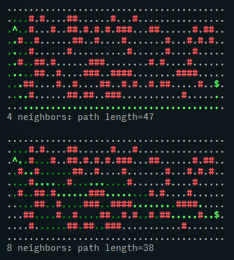

# Pasta: a pluggable A* implementation



[Wikipedia article about A*](https://en.wikipedia.org/wiki/A*_search_algorithm)

## Usage

BYOC -- Bring Your Own Context. The algorithm is decoupled from the underlying (graph? grid?) pathfindable data structure. You need to provide:

  - a **cost** function that computes the cost of traveling from one node to another
  - a **heuristic** function that estimates the cost of traveling from one node to the target ()
  - a **neighbors** function that returns a set of neighbor nodes reachable from a given node

Individual nodes can be identified by any value -- just make sure that your `neighbors` implementation generates comparable identifiers.

This algorithm is using an *h-based tie breaking* to reduce the number of visited nodes for same-cost paths. According to [Amit-the-A*-guru](https://theory.stanford.edu/~amitp/GameProgramming/Heuristics.html#breaking-ties), this is an idea by Steven van Dijk.

```ts
import { pasta } from "https://cdn.jsdelivr.net/gh/ondras/pasta@main/pasta.ts";

const N = 5; // our graph is a 5x5 grid

function taxicab(x1, y1, x2, y2) { return Math.abs(x1-x2) + Math.abs(y1-y2); }

function cost(from, to) {
  let [x1, y1] = from.split(",").map(Number);
  let [x2, y2] = to.split(",").map(Number);
  return taxicab(x1, y1, x2, y2);
}

function heuristic(from, to) {
  return cost(from, to); // often, we can re-use the cost function as heuristic
}

function neighbors(node) {
  let [x, y] = node.split(",").map(Number);
  return [[-1,0],[1,0],[0,-1],[0,1]]
    .map(([dx, dy]) => [x+dx, y+dy])
    .filter(([x, y]) => x>=0 && y>=0 && x<N && y<N)
    .map(xy => xy.join(","));
}

let options = { cost, neighbors, heuristic };
let path = pasta("0,0", "4,4", options);
console.log(path); // 0,0 -> 1,0 -> ... -> 4,0 -> 4,1 -> ... -> 4,4
```
